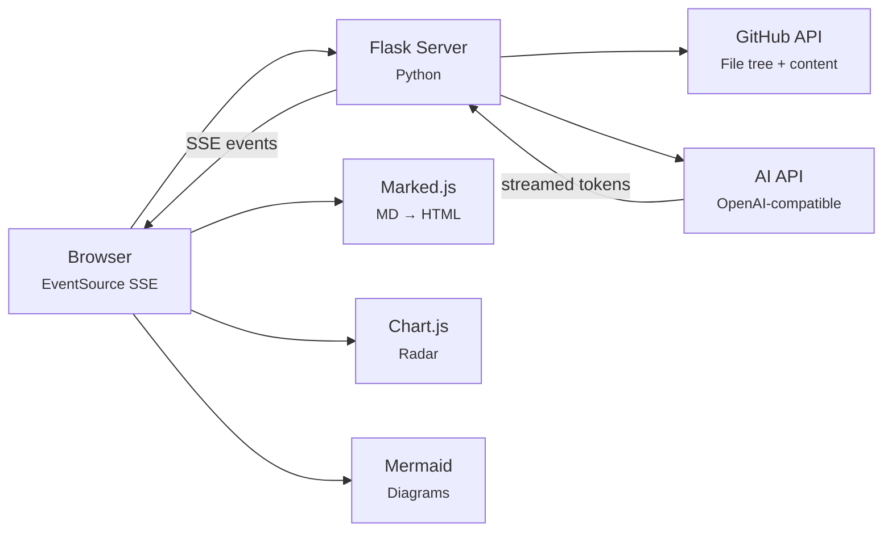
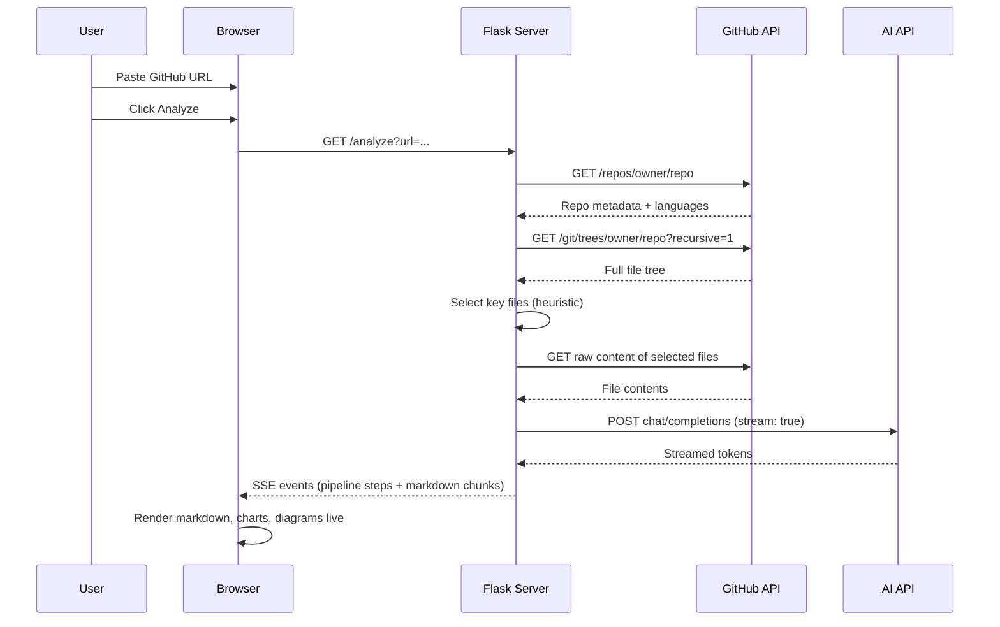

<div align="center">
  <span style="color:#ffffff;background:#000000;font-weight:700;font-size:28px;line-height:32px;vertical-align:middle;">Dev</span><span style="color:#58a6ff;background:#000000;font-weight:700;font-size:28px;line-height:32px;vertical-align:middle;">Shrink  </span>
  <br/>
  <br/>
  <em>Paste a GitHub URL. Get a structured onboarding report in seconds.</em>
</div>

<p align="center">
  <a href="https://devshrink.onrender.com">
    
  </a>
  <a href="#-features"></a>
  <a href="#-architecture"></a>
  <a href="#-quick-start"></a>
  <a href="#-stack"></a>
</p>

<p align="center">
  
  
  
  
  
  
  
</p>

---

## 💡 The Problem

Every developer knows the drill: you join a new team, inherit a legacy project, or evaluate a library — and you spend hours clicking through files, reading stale READMEs, and trying to figure out where anything lives.

**READMEs are out of date. Wikis are empty. "Just read the code" isn't onboarding — it's archaeology.**

## 🎯 The Solution

DevShrink automates the first pass. Give it any public GitHub repository and it:

| Step | What happens |
|------|-------------|
| 1 | Scans the full file tree via the GitHub API |
| 2 | Intelligently selects meaningful files (entry points, configs, critical modules) |
| 3 | Sends structured context to an LLM |
| 4 | **Streams** back a living document — architecture, setup, key files, code quality, and a new-contributor action plan |

**No setup. No sign-up. No fluff. All streaming in real-time.**

---

## ✨ Features

- **Real-time SSE streaming** — events arrive the instant the LLM emits them, not when the response finishes
- **Smart file selection** — prioritizes README, configs, entry points, recently modified modules; skips `node_modules`, build artifacts, binaries
- **Primary language detection** — computed from GitHub's byte-count language map, skipping markup languages when a real language exists
- **Radar chart** — visual snapshot of codebase health (modularity, documentation, test coverage, dependency freshness)
- **Language bar** — byte-proportional breakdown of every language in the repo
- **Mermaid diagrams** — rendered architecture flowcharts when the AI generates them
- **Live console feed** — watch every pipeline step as it executes
- **Dark theme, premium typography** — Playfair Display headings, Inter body, JetBrains Mono code
- **Fully responsive** — works on desktop, tablet, and phone

---

## 🏗️ Architecture



### Why EventSource over fetch?

Native browser SSE (`EventSource`) delivers each `data:` line in real-time. `fetch()` + `ReadableStream.getReader()` buffers the entire response body on most browsers — defeating the purpose of streaming. Trade-off: SSE is GET-only, so the URL carries the repo as a query parameter.

### File selection heuristic

1. README always included
2. Config files matched by name and extension (`package.json`, `Cargo.toml`, `Dockerfile`, `.env.example`, etc.)
3. Entry-point source files (e.g. `main.py`, `app.js`, `index.ts`)
4. Recently modified source modules (up to 12k chars per file, 60k chars total)
5. Everything else is excluded: `node_modules`, `vendor/`, build output, binary files, lockfiles

### Rate limiting

The `/analyze` endpoint is limited to **2 requests per minute per IP address** using a thread-safe in-memory sliding window (`threading.Lock` + timestamp log). Exceeded requests receive an SSE error event and a `429` HTTP status with a `Retry-After` header. This is a single-process limiter — multi-worker deployments should replace the in-memory store with Redis.

---

## 🚀 Quick Start

```bash
# Clone
git clone https://github.com/shumaqueraza/devshrink
cd devshrink

# Install
pip install -r requirements.txt

# Configure (create .env)
AI_API_KEY=your_key_here
AI_BASE_URL=https://generativelanguage.googleapis.com/v1beta/openai/
AI_MODEL=gemini-2.5-flash
# GITHUB_TOKEN=optional — higher API rate limit

# Run
python app.py
```

Open `http://localhost:5000`, paste a GitHub URL, and get your report.

> **Live demo:** [devshrink.onrender.com](https://devshrink.onrender.com)

---

## 🧱 Stack

| Layer | Technology |
|-------|-----------|
| **Backend** | Python 3 + Flask |
| **AI Provider** | Any OpenAI-compatible API (Gemini, NVIDIA NIM, OpenAI, etc.) |
| **Streaming** | Server-Sent Events (native `EventSource`) |
| **Frontend** | Vanilla HTML / CSS / JS with ES6 modules |
| **Markdown** | marked.js (9.x) |
| **Charts** | Chart.js 4 (radar) |
| **Diagrams** | Mermaid 10 |
| **Typography** | Playfair Display + Inter + JetBrains Mono |
| **API** | GitHub REST (no auth required for public repos) |

---

## 📁 Project Structure

```
├── app.py                  # Flask backend — single file
├── requirements.txt        # Python dependencies
├── templates/
│   └── index.html          # Shell: landing page + analysis view
├── static/
│   ├── css/
│   │   └── styles.css      # Full design system (~1100 lines)
│   └── js/
│       ├── app.js          # Controller — wiring, lifecycle
│       ├── analyzer.js     # SSE handler — pipeline orchestration
│       ├── ui.js           # DOM utilities — selectors, animation, clipboard
│       ├── terminal.js     # Live console feed widget
│       ├── dashboard.js    # Info card + radar + language bar
│       ├── charts.js       # Chart.js radar chart factory
│       └── mermaid-renderer.js  # Mermaid dark theme + render
└── README.md
```

Design principle: **single-file backend, modular frontend**. Every JS module has one responsibility and zero framework dependencies.

---

## ⚙️ Configuration

| Variable | Required | Default | Description |
|----------|----------|---------|-------------|
| `AI_API_KEY` | Yes | — | AI provider API key |
| `AI_BASE_URL` | No | `https://generativelanguage.googleapis.com/v1beta/openai/` | OpenAI-compatible endpoint |
| `AI_MODEL` | Yes | — | Model name |
| `GITHUB_TOKEN` | No | — | GitHub PAT (higher rate limit) |

---

## 🔍 How It Works (Detail)



---

<p align="center">
  <sub>Built at <strong>MicroCraft Vibeathon</strong> — June 2026</sub>
  <br/>
  <sub>
    <a href="https://devshrink.onrender.com">Live Demo</a> ·
    <a href="https://github.com/shumaqueraza/devshrink">GitHub</a>
  </sub>
</p>
